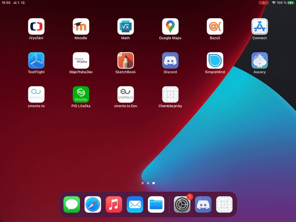

# Periodic table quiz
Basic app to task user elements witch want to learn. On home screen user shuld see complet statistic.

## Example

## Dependencis
- sql-lite (so save active element to quiz)
- xamarin forms (to make it works)

